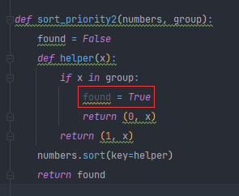

# effective python 10~20 items 

## **Item 11: Use** **zip** **to Process Iterators in Parallel**  (zip , 给我排排站好)

这玩意说实话,很少用,都是只有在科学计算(numpy) 或者 转置矩阵之类的操作才会用到

我也是在之前学习转置一个矩阵的时候才用过这玩意.

```
a=[
    [1,2,3],
    [4,5,6],
    [7,8,9]
]
for _ in list(zip(*a)):
    print(_)
```

 得到转置后的矩阵

```
(1, 4, 7)
(2, 5, 8)
(3, 6, 9)
```

如果正常写的话会比较笨拙

```
b=[]
for i,l in enumerate(a):
    b.append([c[i] for c in a])
for _ in b:
    print(_)
```

```
[1, 4, 7]
[2, 5, 8]
[3, 6, 9]
```

这玩意我用得少,还有个栗子是这样的

```

names = ["Cecilia", "Lise", "Marie"]
letters = [len(n) for n in names]
longest_name = None
max_letters = 0
for i in range(len(names)):
    count = letters[i]
    if count > max_letters:
        longest_name = names[i]
        max_letters = count
print(longest_name)
```

这段代码想得到最长的名字 只能像这样用索引平行 并行的判断.很多**代码噪音**

如果使用 enumerate 的话 会减少一点噪音 减少了索引的噪音

```
for i, name in enumerate(names): 
    count = letters[i] 
    if count > max_letters: 
        longest_name = name 
        max_letters = count
```

如果使用zip 就可以并行的判断了

```
for name, count in zip(names, letters): 
    if count > max_letters: 
        longest_name = name 
        max_letters = count
```

```
Cecilia 7
Lise 4
Marie 5
```

不过注意的是 如果两个迭代器长度不同 zip会停止迭代

```

names = ["Cecilia", "Lise", "Marie","123"]
letters = [len(n) for n in names[:2]]

print(list(zip(names,letters)))
```

```
[('Cecilia', 7), ('Lise', 4)]	
```

使用itertools自带的 zip_longest即可

```
import itertools

names = ["Cecilia", "Lise", "Marie","123"]
letters = [len(n) for n in names[:2]]

print(list(itertools.zip_longest(names,letters)))
```

```
[('Cecilia', 7), ('Lise', 4), ('Marie', None), ('123', None)]
```

会填充None回去

### **Things to Remember** 

- The zip built-in function can be used to iterate over multiple iterators in parallel. In Python 3, zip is a lazy generator that produces tuples. 
- In Python 2, zip returns the full result as a list of tuples. zip truncates its output silently if you supply it with iterators of different lengths. 
- The zip_longest function from the itertools built-in module lets you iterate over multiple iterators in parallel regardless of their lengths (see Item 46: “Use Built-in Algorithms and Data Structures”). 

## **Item 12: Avoid** **else** **Blocks After** **for** **and** **while** **Loops** (避免使用奇怪的for-else表达,属于是写了还不如不写)

for else 我相信也很少人用的 更别说避免了 这个语法表意其实是不清晰的 是没有必要的语法

```
for i in range(10):
    print(i)
else:
    print('print finished')
```

```
0
1
2
3
4
5
6
7
8
9
print finished

```

如果不在循环内加上 break 语句 for - else 其实是一个迷惑的行为

> The else clause of a loop is skipped when a break is executed in this loop. In other words, a loop with an else but no break statement will always execute the else part (unless of course an exception is raised or return is used). If this is what the developer intended, it would be much simpler to have the else statement removed and its body unindented. Thus having a loop with an else and no break is most likely an error.

也就是如果 break出来后 将不会执行else 否则就执行 暂时没发现有什么用处 那就建议不要用了

```
def while_else_test():
    while 1:
        print(1)
        break
    else:
        print('print finished')
while_else_test()
```

while 也是一样的

如果想break后执行什么 直接用return 就好了 不要违反直觉了

### **Things to Remember** 

- Python has special syntax that allows else blocks to immediately follow for and while loop interior blocks. 
- The else block after a loop only runs if the loop body did not encounter a break statement.
- Avoid using else blocks after loops because their behavior isn’t intuitive and can be confusing. 

## **Item 13: Take Advantage of Each Block in** try/except/else/finally (健壮性的异常捕获4大金刚)

使用这种格式捕获异常会使程序可读性更好并且健壮性更好

```
try:
    print(1/0)
except ZeroDivisionError:
    print('1/0不行')
else:
    print("1/0 是可以的啦")
finally:
    print('计算结束咯')
```

逻辑大概是这样的, 当然这里体现不出什么,先来一个比较常见的

```
a={1:2,3:4}
try:
    a[4]
except KeyError:
    print('a 里面 没有 4')
else:
    print("a里面有 4啊")
finally:
    if 4 not in a:
        a[4]=5
        print("彳亍 我给你加上")

try:
    a[4]
except KeyError:
    print('a 里面 没有 4]')
else:
    print("a里面有 4啊")
finally:
    if 4 not in a:
        a[4]=5
        print("彳亍 我给你加上")
```

这里可以用 这四个关键字做到一个 类似 字典setdefault的效果.

### **Things to Remember** 

- The try/finally compound statement lets you run cleanup code regardless of whether exceptions were raised in the try block. 
- The else block helps you minimize the amount of code in try blocks and visually distinguish the success case from the try/except blocks. 
- An else block can be used to perform additional actions after a successful try block but before common cleanup in a finally block.

# **2.** **Functions**

> The first organizational tool programmers use in Python is the *function*. As in other programming languages, functions enable you to break large programs into smaller, simpler pieces. They improve readability and make code more approachable. 
>
> They allow for reuse and refactoring. Functions in Python have a variety of extra features that make the programmer’s life easier. Some are similar to capabilities in other programming languages, but many are unique to Python. 
>
> These extras can make a function’s purpose more obvious. 
>
> They can eliminate noise and clarify the intention of callers. 
>
> They can significantly reduce subtle bugs that are difficult to find. 

python里 函数是一等公民 那么你就可以函数式编程了(不是

## **Item 14: Prefer Exceptions to Returning** **None** (越早报错越好)

早点报错早点debug啊啊啊

返回一个None 是不好的语法实际上 但是很多时候又有用

这里强调的是 对于错误的输入 不要return None 而不是不给return None

这里是一个简单的例子

```
def divide(a, b): 
    try:
        return a / b 
    except ZeroDivisionError: 
        return None
```

如果不报错  那么 是不知道里面发生了什么的,这样对后面的维护 debug 非常不友好

而且在外部还要判断

```
x, y = 0, 5 
result = divide(x, y) 
if not result: 
    print('Invalid inputs') # This is wrong!
```

关键是如果本来就返回0就裂开 所以还要改成

```
x, y = 0, 5
result = divide(x, y)
if result is not None:
    print('Invalid inputs') # This is right!
```

属于是比较sb了 所以 不要这样啊

虽然可以返回一个元组来判断

```
try:
    return True, a / b 
except ZeroDivisionError: 
    return False, None
```

我们的检查脚本就是这样的 返回一个bool 判断正确与否 和一个信息

### **Things to Remember** 

- Functions that return None to indicate special meaning are error prone because None and other values (e.g., zero, the empty string) all evaluate to False in conditional expressions.
- Raise exceptions to indicate special situations instead of returning None. Expect the calling code to handle exceptions properly when they’re documented. 

## **Item 15: Know How Closures Interact with Variable Scope** (你根本不关心闭包,你只关心你自己!)

闭包是python重要的一个高级特性,直接决定了你python的功底,所以要多多关心可爱的闭包.

闭包 闭包其实用的也不多 或者说用了都没察觉到 , 比如 装饰器这种.

闭包的作用域这里我写了一个简单的例子

```
def closure():
    l=[]
    def count(j):
        for i in range(j):
            l.append(i)
        return l
    return count
count=closure()
print(count(3))
print(count(4))
print(count(5))
```

输出

```
[0, 1, 2]
[0, 1, 2, 0, 1, 2, 3]
[0, 1, 2, 0, 1, 2, 3, 0, 1, 2, 3, 4]
```

可以看到 列表 l 是属于closure的 但是在之后的调用里还是能够 使用 这个 l 列表 说明他的生存周期被延长了 

也就是说被封装在count 这个函数里了

再来看一个例子,该例子实现了一个 包含关系的排序

```
def sort_priority(values, group):
    """
    只排序不在group的values 其他不排序
    :param values:
    :param group:
    :return:
    """
    def helper(x):
        if x in group:
            return (0, x)
        return (1, x)
    values.sort(key=helper)


numbers = [8, 3, 1, 2, 5, 4, 7, 6]
group = {2, 3, 5, 7}
sort_priority(numbers, group)
print(numbers)
```

```
[2, 3, 5, 7, 1, 4, 6, 8]
```

可以看到 在group 集合里的都没有被排序 这里是可以运行的. 这也是闭包的一种体现

> Python supports *closures*: functions that refer to variables from the scope in which they were defined. This is why the helper function is able to access the group argument to sort_priority.

包括体现了 函数是一等公民 可以作为函数指针传入

> Functions are *first-class* objects in Python, meaning you can refer to them directly, assign them to variables, pass them as arguments to other functions, compare them in expressions and if statements, etc. 
>
> This is how the sort method can accept a closure function as the key argument

元组表达式会顺序比较下去,.直到遇到True值

> Python has specific rules for comparing tuples. It first compares items in index zero, then index one, then index two, and so on. 
>
> This is why the return value from the helper closure causes the sort order to have two distinct groups. 

再来看一个例子

```
def sort_priority2(numbers, group):
    found = False
    def helper(x):
        if x in group:
            found = True
            return (0, x)
        return (1, x)
    numbers.sort(key=helper)
    return found

found = sort_priority2(numbers, group)
print(found)
print(numbers)
```

你可能会觉得  肯定found 为True 实际上 是False

```
False
[2, 3, 5, 7, 1, 4, 6, 8]
```

因为变量被 **遮掩** 了 里层的helper函数的found实际上是函数里面的局部变量 无法传递出去 只能在该函数内体现生存周期.

pycharm已经给出了该提示



提示是未使用的local 变量

> If a local variable is declared but not used, it is dead code and should be removed. Doing so will improve maintainability because developers will not wonder what the variable is used for.

所以只能返回False了

如果要使用found 你可以在python3 使用关键字 nonlocal

```
def sort_priority2(numbers, group):
    found = False
    def helper(x):
        nonlocal found
        if x in group:
            found = True
            return (0, x)
        return (1, x)
    numbers.sort(key=helper)
    return found
```

这样就能返回True了

对于python2 没有nonlocal 但也有别的办法 你可以用 mutable 对象真假判断

```
def sort_priority2(numbers, group):
    found = []
    def helper(x):

        if x in group:
            found.append(1)
            return (0, x)
        return (1, x)
    numbers.sort(key=helper)
    return bool(found)
```

> As explained above, Python will traverse up the scope where the found variable is referenced to resolve its current value. The trick is that the value for found is a list, which is mutable. This means that once retrieved, the closure can modify the state of found to send data out of the inner scope (with found[0] = True)

### **Things to Remember** 

- Closure functions can refer to variables from any of the scopes in which they were defined. 
- By default, closures can’t affect enclosing scopes by assigning variables. 
- In Python 3, use the nonlocal statement to indicate when a closure can modify a variable in its enclosing scopes. 
- In Python 2, use a mutable value (like a single-item list) to work around the lack of the nonlocal statement. 
- Avoid using nonlocal statements for anything beyond simple functions. 

## **Item 16: Consider Generators Instead of Returning Lists** ( Less is more 人喜欢接收更简洁的信息)

我宁愿事情一件一件来,也不愿突然排山倒海的到来,人都如此,编译器也是这么想的.

尽量不要返回一个列表 尽量返回一个生成器 快而占内存比较小

python 也可以执行效率很高 关键是你想不想写成这样

写一个统计单词位置,正常写你可能会这么写

```
import pprint

import faker


def index_words(text):
    print(text)
    result = []
    if text:
        result.append(0)
    for index, letter in enumerate(text):
        if letter ==' ':
            result.append(index + 1)
    return result
f=faker.Faker()
pprint.pprint(index_words(f.text())[:5])
```

```
Change past again fish voice much. Ability family war yes out policy fight. Adult add kind herself.
Forget fact detail system magazine. Fine parent family religious soldier.
[0, 7, 12, 18, 23 ,..]
```

首先是 代码噪音比较多 就看起来就比较不优雅 不 pythonic.

> The first problem is that the code is a bit dense and noisy. Each time a new result is found, 
>
> I call the append method. The method call’s bulk (result.append) deemphasizes the value being added to the list (index + 1). There is one line for creating the result list and another for returning it. While the function body contains ~130 characters (without whitespace), only ~75 characters are important. 

很多时候你需要更优雅的方式

比如这样

```
def index_words(text):
    print(text)
    if text:
        yield 0
    for index, letter in enumerate(text):
        if letter ==' ':
            yield index + 1
            
f=faker.Faker()
pprint.pprint(list(index_words(f.text()))[:5])
```

没有了return 没有了 append 没有了列表 是不是舒服了很多?

```
Item step college doctor argue tonight. Walk scientist on loss fall left idea.
Add bit floor scene establish training identify.
Than create day. Scientist around case page per left stage.
[0, 5, 10, 18, 25]
```

返回的生成器要list一下哦

看看下面这句话 好好理解一下

> **It’s significantly easier to read because all interactions with the result list have been eliminated.**

值得一提的是 我们平时用的with open file也是一个生成器

```
with open("faker.txt",'r') as f:
    for line in f:
        print(line)
```

```
Husband price unit seek. This practice seek really. Garden win find one.

Amount three song even subject. Another realize support table policy voice.

```

你可以这样得到他的所有行内容,不过她本身也提供了readlines 可以返回一个列表

```
with open("faker.txt",'r') as f:
    print(f.readlines())
```

```
['Husband price unit seek. This practice seek really. Garden win find one.\n', 'Amount three song even subject. Another realize support table policy voice.']
```

**多用就行 能用就多点用** 

### Things to Remember** 

- Using generators can be clearer than the alternative of returning lists of accumulated results. 
- The iterator returned by a generator produces the set of values passed to yield expressions within the generator function’s body. 
- Generators can produce a sequence of outputs for arbitrarily large inputs because their working memory doesn’t include all inputs and outputs. 


## **Item 17: Be Defensive When Iterating Over Arguments** ( 有些生成器 一去不回)

使用生成器对象时 要注意一些事 那就它的生命只有一段序列 无法回头

又何尝不是人生呢?

```
life=iter(["baby","child","teenager","adult","aged","old"])
next(life)
next(life)
next(life)
next(life)
next(life)
# 无论怎么样都回不了头了
last=?
```

所以如果你已经遍历过一次生成器,却不死心想重头再来

还想遍历一次,那就像阳寿已尽的老人, 只会给你一个空的躯壳,让你暗自神伤

```

life=iter(["baby","child","teenager","adult","aged","old"])
next(life)
next(life)
next(life)
next(life)
next(life)
next(life)
print(list(life))
for l in life: # do nothing
    print(l)
```

```
[]
```

这时候你可以创建一个生成器函数,每次调用的时候都返回一个全新的生成器 类似这个世界上另外一个你

```
def get_life():
    return iter(["baby","child","teenager","adult","aged","old"])

life=get_life()
next(life)
next(life)
next(life)
next(life)
next(life)
next(life)

for l in get_life(): # it work
    print(l)

```

```
baby
child
teenager
adult
aged
old
```

life 被掏空后就会抗议 stopiteration了

你可以捏一个类,用来迭代

```
class Numbers:
    def __init__(self):
        self.nums=[i for i in range(10)]
    def __iter__(self):
        for num in self.nums:
            yield num

for num in Numbers():
    print(num)
```

**最后记住,生成器的使用决定了你python水平的上限**

### **Things to Remember** 

- Beware of functions that iterate over input arguments multiple times. If these arguments are iterators, you may see strange behavior and missing values. 
- Python’s iterator protocol defines how containers and iterators interact with the iter and next built-in functions, for loops, and related expressions. 
- You can easily define your own iterable container type by implementing the iter method as a generator. 
- You can detect that a value is an iterator (instead of a container) if calling iter on it twice produces the same result, which can then be progressed with the next built- in function. 

## **Item 18: Reduce Visual Noise with Variable Positional** **Arguments**  ( 使用可选参数替代多余的函数参数)

 这里直说了,可以减少代码噪音,那么就能够看上去整洁舒服很多的

```
def log(message, *values): # The only difference
    if not values:
        print(message)
    else:
        values_str = ','.join(str(x) for x in values)
        print("%s: %s" % (message, values_str))
log('My numbers are', 1, 2)
log('Hi there') # Much better
```

这里的实现类似于print 函数,可以一直填入可选的参数,如果不这么实现,就有可能像这样

```
def log(message, values): 
    if not values:
        print(message)
    else:
        values_str = ','.join(str(x) for x in values)
        print("%s: %s" % (message, values_str))
log('My numbers are', [1, 2])
log('Hi there',[])
```

传入了多余的不必参数,比较蠢

其次你可以使用*解包,就像这样,会比较好看

```
log('My numbers are',*[1,3,4,5,2,3])
```

但是这个开销会比较大,因为会直接返回所有的数据,内存占用较大

特别是对于生成器来说,他的作用于list相同

```
gen=iter([1,3,4,5,2,3])
print(*gen)
log('My numbers are',*gen)
log('Hi there') # Much better.
```

```
1 3 4 5 2 3
My numbers are
Hi there
```

不过使用位置参数的时候要注意前后顺序,否则会导致一些隐藏的bug

```
def log(number,message, *values): # The only difference
    if not values:
        print(message)
    else:
        values_str = ','.join(str(x) for x in values)
        print("%s: %s" % (message, values_str))
log(1,"12312",*[123,123])
log("12312",123,*[123,123])
```

像这样的函数参数位置问题,会引发一些不易察觉的bug 所以你需要认真了

### **Things to Remember** 

- Functions can accept a variable number of positional arguments by using *args in the def statement. 
- You can use the items from a sequence as the positional arguments for a function with the * operator. 
- Using the * operator with a generator may cause your program to run out of memory and crash. 
- Adding new positional parameters to functions that accept *args can introduce hard-to-find bugs. 

## **Item 19: Provide Optional Behavior with Keyword** **Arguments** (合理使用显式函数参数传递)

python允许你在传入参数时显式指定

```
def exmaple(a,b,c):
    return a,b,c

exmaple(a=1,b=2,c=3)
```

注意顺序问题即可

如果像这样无厘头的传入参数会让人感到困惑

```
pounds_per_hour = flow_rate(weight_diff, time_diff, 3600, 2.2)
```

所以大多数时候你最好显式指定

```
pounds_per_hour = flow_rate(c=weight_diff, d=time_diff, a=3600, b=2.2)
```

如果你自己懒得写,你可以强制自己写,python3有强制关键字参数 *

```
def exmaple(*,a,b,c):
    return a,b,c
```

你有本事不写,不写就报错

```
TypeError: exmaple() takes 0 positional arguments but 3 were given
```

json库里也有这样的表达

```
def dump(obj, fp, *, skipkeys=False, ensure_ascii=True, check_circular=True,
        allow_nan=True, cls=None, indent=None, separators=None,
        default=None, sort_keys=False, **kw):
```


### **Things to Remember** 

- Function arguments can be specified by position or by keyword. 
- Keywords make it clear what the purpose of each argument is when it would be confusing with only positional arguments. 
- Keyword arguments with default values make it easy to add new behaviors to a function, especially when the function has existing callers. 
- Optional keyword arguments should always be passed by keyword instead of by position. 

## **Item 20: Use** **None** **and Docstrings to Specify Dynamic** **Default Arguments (使用None 和 文档字符串来指定动态默认属性)

由于python函数参数是在编译期决定的,所以你无法做到像这样的指定一个当前时间作为函数参数

```
def log(message, when=datetime.now()):
    print(when)
log("asdasd")
log("asdasd")
log("asdasd")

```

```
2021-09-13 23:39:39.544087
2021-09-13 23:39:39.544087
2021-09-13 23:39:39.544087
```

是一样的

我知道你稍微改一下就可以了

```
def log(message, when=None):
    when = datetime.now() if when else datetime.now()
    time.sleep(0.1)
    print(when)
log("asdasd")
log("asdasd")
log("asdasd")
log("asdasd")
log("asdasd")
log("asdasd")
```

```
def log(message, when=None):
    when = when or datetime.now()
    time.sleep(0.1)
    print(when)
log("asdasd")
log("asdasd")
log("asdasd")
log("asdasd")
log("asdasd")
log("asdasd")
```

```
2021-09-13 23:41:47.951759
2021-09-13 23:41:48.064900
2021-09-13 23:41:48.175942
2021-09-13 23:41:48.284908
2021-09-13 23:41:48.393819
2021-09-13 23:41:48.504401
```

更要注意的是,函数参数一定不能使用mutable 类型 (可变参数) 例如 [] {} set() 各种数据结构类 等等

由于是编译器决定参数的,所以函数参数会在编译期就创建好了

> This inspection detects when a mutable value as list or dictionary is detected in a default value for an argument. Default argument values are evaluated only once at function definition time, which means that modifying the default value of the argument will affect all subsequent calls of the function.

```
def example(a=[]):
    a.append(1)

example()
example()
example()
example()
print(example.__defaults__)
```

```
([1, 1, 1, 1],)
```

你会发现a的生存期被保留了 就像闭包一样生存在了example中,很恶心的 通常不是你要的效果

### **Things to Remember** 

- Default arguments are only evaluated once: during function definition at module load time. This can cause odd behaviors for dynamic values (like {} or []). 
- Use None as the default value for keyword arguments that have a dynamic value. Document the actual default behavior in the function’s docstring